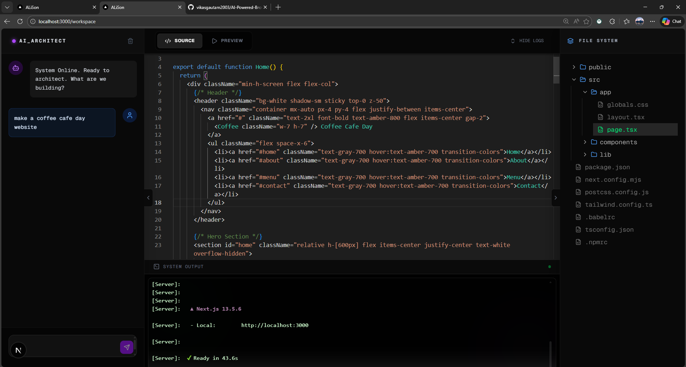

# ⚡ BrowserIDE

**A browser-native IDE that boots a full Node.js container, runs a terminal, and deploys a live preview—all powered by AI.**

BrowserIDE replaces the traditional cloud VM with **WebContainers**, allowing you to run `npm install` and `npm run dev` directly inside Chrome with zero latency. It features an integrated AI Copilot that can generate, refactor, and debug code across your entire file system.

*(Note: Replace this with an actual screenshot of your IDE interface)*

---

## ✨ Key Features

### 🚀 **Browser-Native Node.js**
Powered by [WebContainers](https://webcontainers.io/), this IDE boots a real Node.js environment inside your browser tab.
- **Zero Latency:** No cloud connection required for command execution.
- **Security:** Code runs in a sandboxed environment isolated from your local machine.

### 🤖 **AI-Powered Coding Assistant**
An intelligent coding agent integrated directly into the workspace.
- **Context-Aware:** The AI reads your virtual file system to understand your project structure.
- **Full-File Generation:** Generates robust, production-ready code blocks (React components, API routes, configurations).
- **Automated Refactoring:** Request changes in plain English (e.g., *"Convert this page to use Tailwind grid"*).

### 💻 **Integrated Terminal**
A fully functional zsh-like terminal using **xterm.js**.
- Run standard commands: `npm install`, `npm run dev`, `node script.js`.
- View server logs and build errors in real-time.
- Supports colored output and ANSI escape codes.

### 🌐 **Instant Live Preview**
- **Hot Reloading:** See changes instantly as the AI writes code.
- **Secure Iframe:** The running localhost server is piped securely to an embedded preview window.

---

## 🛠️ Tech Stack

- **Framework:** Next.js 14 (App Router)
- **Language:** TypeScript
- **Runtime:** WebContainers API (Node.js in browser)
- **Terminal:** Xterm.js + FitAddon
- **Styling:** Tailwind CSS
- **Icons:** Lucide React
- **State Management:** Zustand (for File Tree state)
- **AI Model:** Google Gemini / Anthropic Claude (via API)

---

## 🚀 Getting Started

Follow these steps to run the BrowserIDE locally.

### Prerequisites
- Node.js 18+ installed.
- A modern browser (Chrome/Edge/Arc) that supports Cross-Origin Isolation.

